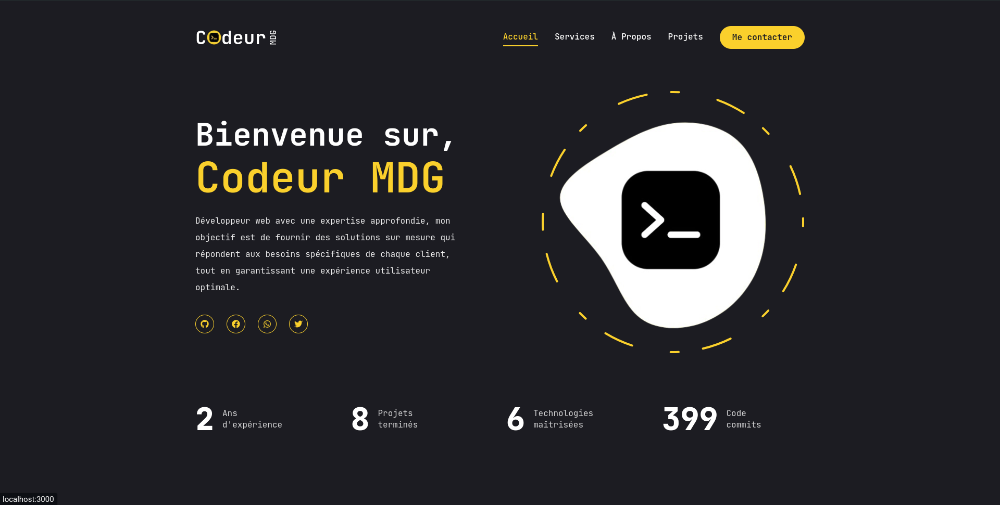

## Portfolio



First, clone this repo [https://github.com/codeurMDG/codeur-portfolio](https://github.com/codeurMDG/codeur-portfolio)

```bash
git clone https://github.com/codeurMDG/codeur-portfolio
```

Install all dependancy :

```bash
npm install
```

Run the development server:

```bash
npm run dev
```

Open [http://localhost:3000](http://localhost:3000) with your browser to see the result.